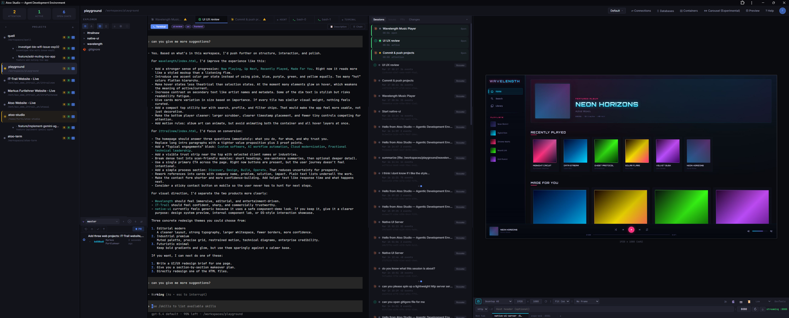
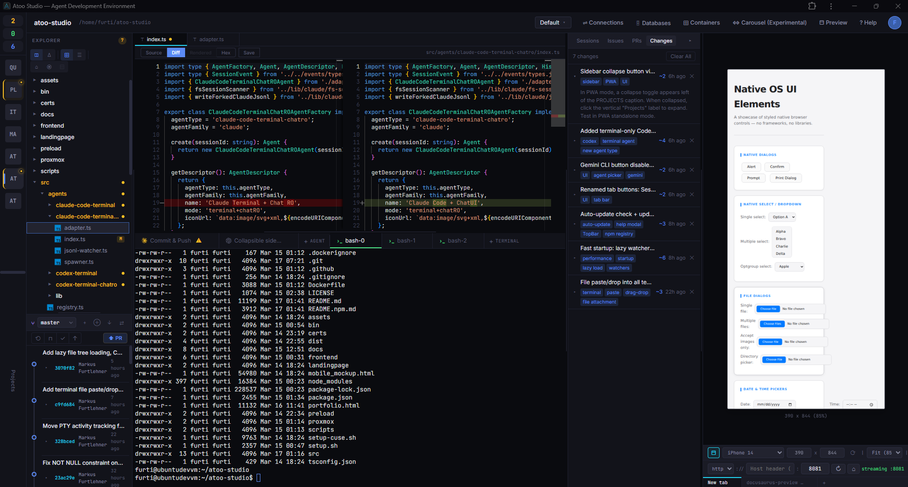
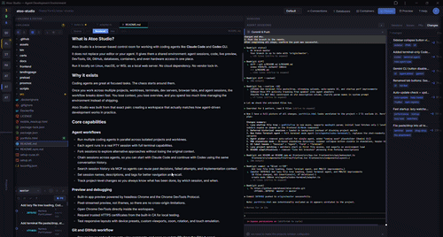
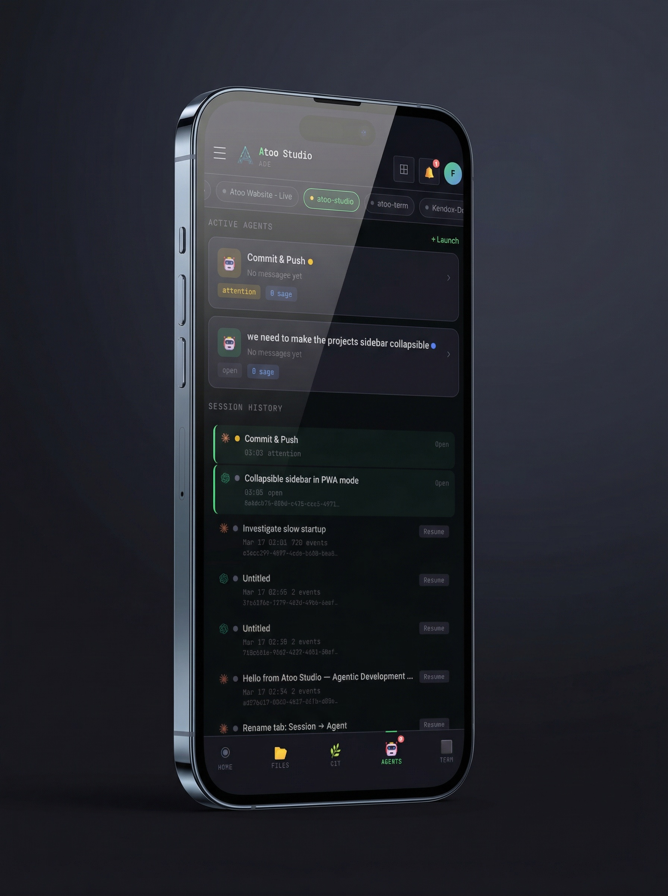

<p align="center">
  
</p>

<h1 align="center">Atoo Studio</h1>

<p align="center">
  <strong>A local-first control room for real coding-agent workflows.</strong><br>
  Run multiple PTY-backed agent sessions across projects and worktrees, fork and chain sessions, and keep code, preview, DevTools, GitHub, databases, containers, and hardware in one place.<br>
  <em>Familiar where it helps. Different where it matters: the agent workflow is the product, not a sidebar.</em>
</p>

<p align="center">
  Works with <a href="https://docs.anthropic.com/en/docs/claude-code">Claude Code</a>, <a href="https://github.com/openai/codex">Codex CLI</a>, and other coding agents.
</p>

<p align="center">
  
</p>

<p align="center">
  <a href="https://atoo.ai">Website</a> ·
  <a href="#demo">Demo</a> ·
  <a href="#getting-started">Getting Started</a> ·
  <a href="#core-capabilities">Core Capabilities</a> ·
  <a href="#platform-support">Platform Support</a>
</p>

<p align="center">
  Built by <a href="https://github.com/markusfurtlehner">Markus Furtlehner</a> ·
  <a href="https://www.ittrail.at">IT Trail GmbH</a>
</p>

> **Early alpha, already used daily for real client work.**
>
> **Not a chat wrapper. Not just an editor skin.** Atoo Studio replaces the fragmented VS Code + browser + terminal workflow around coding agents with one local workspace.
>
> **The default layout is intentionally familiar. The workflow model is not.**

---

## Demo

<table align="center">
  <tr>
    <td align="center">
      <video src="https://github.com/user-attachments/assets/7bea0549-ab46-4525-a384-de919396770f" width="820" autoplay loop muted playsinline controls></video>
    </td>
  </tr>
  <tr>
    <td align="center"><sub><strong>New orchestration UI (in progress)</strong> — a newer cross-agent workflow currently on the main branch, but not part of the latest release yet. Parallel agent requests, session forking, and context extraction. Send one prompt to Claude and Codex simultaneously and compare results side by side.</sub></td>
  </tr>
</table>

<table align="center">
  <tr>
    <td align="center"></td>
  </tr>
  <tr>
    <td align="center"><sub>Main workspace — not just an editor layout, but a single working surface for agent sessions, code, preview, and debugging.</sub></td>
  </tr>
</table>

<table align="center">
  <tr>
    <td align="center"></td>
  </tr>
  <tr>
    <td align="center"><sub>Standard (16:9) — collapsible sidebars keep the full workspace usable on smaller screens.</sub></td>
  </tr>
</table>

<table align="center">
  <tr>
    <td align="center"></td>
  </tr>
  <tr>
    <td align="center"><sub>Experimental carousel view — an alternative 2D panel layout where the active view follows mouse movement. One of several layout experiments beyond the default workspace.</sub></td>
  </tr>
</table>

<details>
<summary><strong>Mobile layout</strong></summary>

<table align="center">
  <tr>
    <td align="center"></td>
  </tr>
  <tr>
    <td align="center"><sub>A dedicated layout with all features accessible on any phone or tablet — useful for monitoring and quick interactions on the go.</sub></td>
  </tr>
</table>

</details>

> **More demos and videos are available on the [Atoo Studio homepage](https://atoo.ai).**

## What is Atoo Studio?

Atoo Studio is a local-first workspace for running and managing real coding-agent workflows.

At first glance the default layout looks familiar — on purpose. Files, panes, and text editing should not require relearning. The difference is the orchestration layer around agent-driven development. Real PTY-backed sessions, multi-project and multi-worktree workflows, session fork and continuation across agents, live app preview, DevTools, GitHub, databases, containers, and hardware access all live in one place.

It does not replace the agents themselves. It replaces the fragmented environment around them.

Runs locally on Linux, macOS, or WSL. No cloud dependency. No vendor lock-in.

## Why it exists

Coding agents are great at focused tasks. The chaos starts around them.

Once you work across multiple projects, worktrees, terminals, dev servers, browser tabs, and agent sessions, the workflow breaks down fast. You lose context, you lose overview, and you spend too much time managing the environment instead of shipping.

Atoo Studio was built from that exact pain: creating a workspace that actually matches how agent-driven development works in practice.

## Core capabilities

### Multi-agent mode

Send a single message to Claude Code and Codex simultaneously. Both agents work on the same codebase in parallel, and their responses appear side by side in collapsible dispatch blocks. Conversation history is maintained per agent so each CLI sees a coherent session, with automatic cross-agent format conversion.

### Agent workflows

- Run multiple coding agents in parallel across isolated projects and worktrees.
- Each agent runs in a real PTY session with full terminal capabilities.
- Fork sessions to explore alternative approaches without losing the original context.
- Chain sessions across agents, so you can start with Claude Code and continue with Codex using the same conversation history.
- Search session history via MCP so agents can reuse past decisions, failed attempts, and implementation context.
- Set session names, descriptions, and tags for better navigation and recall.
- Track project-level changes so you always know what has been done, by which session, and when.
- Agents can ask structured questions (single/multiple choice, forms) via an in-tab wizard UI with free-text overrides and conditional visibility.

### Preview and debugging

- Built-in app preview powered by headless Chrome and the Chrome DevTools Protocol.
- Pixel-streamed preview, not iframes, so there are no cross-origin limitations.
- Open Chrome DevTools directly inside the workspace.
- Request trusted HTTPS certificates from the built-in CA for local testing.
- Test responsive layouts with device presets, custom viewports, zoom, rotation, and touch emulation.

### Git and GitHub workflow

- Browse issues and pull requests, view comments, and open or update PRs from the GitHub panel.
- Link sessions to issues or pull requests for better task context.
- Inspect branches, commit history, stashes, and diffs from the Git panel.
- Work with multiple Git worktrees side by side as separate projects.
- Use the one-click **Publish** flow to commit, push, and open a PR.

### Data, infrastructure, and devices

- Explore 15 database types including PostgreSQL, MySQL, SQLite, Redis, MongoDB, Elasticsearch, ClickHouse, CockroachDB, Cassandra, Neo4j, and InfluxDB.
- Auto-discover database connections from `docker-compose` files, environment variables, and port scanning.
- Manage Docker, Podman, and LXC containers from the workspace.
- Browse container images, networks, volumes, compose projects, logs, and stats.
- Connect real hardware like ESP32 boards through Web Serial, bridged to a virtual PTY so agents can flash firmware and monitor output.

### Workspace experience

- File explorer and editor with source, diff, rendered, and hex views.
- Integrated terminal tabs running directly on the server.
- Built-in reverse proxy with subdomain and path-based routing.
- Optional authentication with password, TOTP, and WebAuthn/passkeys.
- Real-time shared workspace views across multiple browsers.
- Responsive mobile layout for monitoring and control on the go.
- Installable as a desktop app via PWA.

## Platform support

| Capability | Linux | macOS | Native Windows |
|------------|-------|-------|----------------|
| Core workspace (agents, terminal, git, files) | Yes | Yes | No |
| Browser preview (CDP streaming) | Yes | Yes | - |
| Serial devices (PTY bridge) | Yes | Yes | - |
| Serial control signals (DTR/RTS via CUSE) | Yes | No | - |

**Native Windows is not supported. Use WSL instead.**

**macOS support is completely untested at this time.** It should work in principle, but expect rough edges.

## Getting started

### Requirements

**Required**
- Node.js 18+
- Git
- Linux, macOS, or WSL

**Optional dependencies**

| Dependency | Enables |
|------------|---------|
| [Claude Code](https://docs.anthropic.com/en/docs/claude-code) (`claude`) | Claude Code agent support |
| [Codex CLI](https://github.com/openai/codex) (`codex`) | Codex agent support |
| [GitHub CLI](https://cli.github.com/) (`gh`) | GitHub issues and PR integration |
| `docker`, `podman`, or `lxc` | Container management |
| `ffmpeg` | Screen recording |
| Chrome libraries on Linux | Browser preview |
| CUSE on Linux | Serial control signals (DTR/RTS) |

Missing optional dependencies are reported as warnings on startup.

### Quick start

```bash
npx atoo-studio
```

Then open `https://localhost:3010` in your browser.

To use a different port, set the `ATOO_PORT` environment variable:

```bash
ATOO_PORT=4000 npx atoo-studio
```

### Docker (untested)

```bash
docker run -p 3010:3010 ghcr.io/atooai/atoo-studio
```

To persist data across container restarts:

```bash
docker run -p 3010:3010 -v atoo-data:/home/atoo/.atoo-studio ghcr.io/atooai/atoo-studio
```

### LXC / LXD (untested)

Download the LXC image from the [latest release](https://github.com/atooai/atoo-studio/releases) and import it:

```bash
lxc image import atoo-studio-lxc-amd64.tar.gz --alias atoo-studio
lxc launch atoo-studio my-atoo-studio
```

### Proxmox (experimental, untested)

Run one of the setup scripts on your Proxmox host:

**LXC container** — lightweight, 2 CPU / 2 GB RAM / 20 GB disk

```bash
bash -c "$(curl -fsSL https://raw.githubusercontent.com/atooai/atoo-studio/main/proxmox/lxc.sh)"
```

**VM** — stronger isolation, CUSE/serial support, 4 CPU / 4 GB RAM / 50 GB disk

```bash
bash -c "$(curl -fsSL https://raw.githubusercontent.com/atooai/atoo-studio/main/proxmox/vm.sh)"
```

Both scripts prompt for container or VM ID, hostname, storage, and resources with sensible defaults.

### Linux setup

To enable browser preview and screen recording support:

```bash
sudo ./setup.sh
```

To enable CUSE for serial control signals like DTR/RTS:

```bash
sudo ./setup-cuse.sh
```

`setup.sh` supports `apt-get` (Debian/Ubuntu), `dnf` (Fedora/RHEL), and `pacman` (Arch).

`setup-cuse.sh` builds the native CUSE helper, loads the kernel module, and configures permissions. Check the script header for container-specific notes for Docker or LXC.

### macOS setup

No additional setup is required for core functionality.

For screen recording support, install `ffmpeg` via the setup script:

```bash
./setup.sh
```

CUSE is not available on macOS, so serial control signals like DTR/RTS are not supported. When flashing boards such as ESP32, use the **BOOT** button manually.

## Architecture

Atoo Studio runs as a single local backend process on the same machine or server as your coding agents.

```text
Browser (any device)
    │
    │ WebSocket + HTTP
    ▼
Atoo Studio Backend
    │
    ├── Agent adapters (Claude Code, Codex, multi-agent)
    ├── PTY session manager
    ├── Session chain & fork system
    ├── Project & worktree manager
    ├── Git & GitHub integration
    ├── Database explorer
    ├── Container manager (Docker, Podman, LXC)
    ├── Reverse proxy with service registry
    ├── CDP preview (headless Chrome)
    ├── Certificate authority
    ├── Serial device bridge
    ├── Authentication system
    └── MCP server
```

Agents run inside real terminal sessions. Atoo Studio does not replace the agent — it provides the environment where agents operate.

## MCP integration

Atoo Studio exposes MCP tools that let agents talk back to the workspace UI.

| Tool | Description |
|------|-------------|
| `generate_certificate` | Request a trusted HTTPS certificate for any hostname |
| `report_tcp_services` | Report started services so they appear in the preview panel |
| `request_serial_device` | Request USB serial device access via the Web Serial bridge |
| `search_session_history` | Search across all session history or within the current session chain |
| `suggest_continue_in_other_session` | Suggest switching to an existing session with relevant context |
| `open_file` | Open a file in the browser editor with user approval |
| `get_session_metadata` | Read session name, description, and tags |
| `set_session_metadata` | Set session name, description, and tags |
| `github_issue_pr_changed` | Notify the UI when a GitHub issue or PR changes |
| `connect_database` | Open the database explorer with a specific connection |
| `track_project_changes` | Track what has been done in a project (get/set/delete) |
| `ask_user` | Ask the user structured questions via an in-tab wizard UI |

## Commercial support

Need help building agent tooling, multi-agent workflows, local-first developer environments, or custom integrations around Claude Code and Codex?

Commercial support and consulting are available via [IT Trail GmbH](https://www.ittrail.at).

## Status

Atoo Studio is in **early alpha**. It is used for real day-to-day development across multiple projects and worktrees, but APIs, configuration, and UI may change without notice.

Bug reports and feedback are welcome.

## Roadmap

- [ ] Add Gemini CLI as a third supported agent
- [ ] Standalone Electron app with real browser sessions for preview (in addition to headless CDP streaming)
- [ ] Refine mobile layout and bring all recently added features to the mobile view
- [ ] Self-hosted Git platform support: Gitea, GitLab, and Azure DevOps Server
- [ ] Evaluate cloud platforms for native management (containers, databases, infrastructure)
- [ ] Experiment with alternative workspace layouts
- [ ] Optional per-project development containers
- [ ] Replace xterm.js with atoo-term (currently in development)

## Feedback

Atoo Studio is not accepting code contributions at this stage. The architecture is evolving quickly and external PRs would likely conflict with ongoing changes.

Bug reports, feature ideas, and workflow pain points are very welcome — please open an issue.

## License

[MIT](LICENSE)

## Author

Built by [Markus Furtlehner](https://github.com/markusfurtlehner) — founder of [IT Trail GmbH](https://www.ittrail.at).

Built from real pain, not a pitch deck.

> [atoo.ai](https://atoo.ai)
